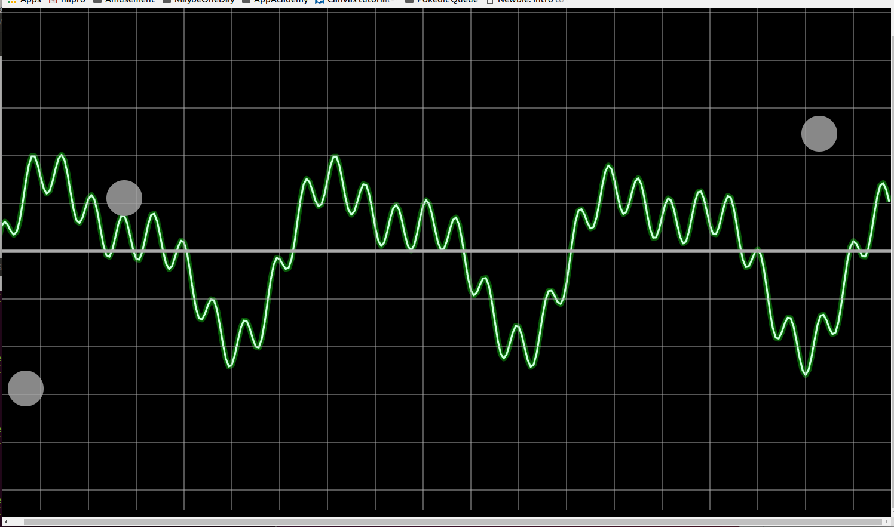

# ThereMax
A simple theremin-esque in-browser instrument. 

A theremin is an early electronic instrumment whose operator can control its sound by varying the distance between his or her 
hands and a separate sensing antennae for each of pitch and amplitude. This project will create a similar instrument whose 
pitch and amplitude will be controlled by the x and y positions of a cursor on a screen. 

### Functionality & MVP

At a minimum, this instrument will:

 - [ ] Emit a tone based on the position of a held-down cursor within the view element.
 - [ ] Render an animated wave form roughly similar to the tone(s) being played. 
 - [ ] Render a grid marking identifiable notes. 
 - [ ] Support place control nodes onto the screen to play tones while the cursor plays other tones. 
 
To epxplain functionality, the project will include at a minimum:

 - [ ] A help modal explaining the features and controls
 - [ ] A production readme. 
 
### Wireframes. 

The instrument will consist of a single screen with the waveform view and links to the help modal and the project github.
Game controls will be simple - click and hold to play a note or click and release to place a draggable control node. 

### Architecture & Technologies

This instrument will be built with the following: 

 - [ ] Vanilla JavaScript, jQuery, and JavaScript's AudioContext for overall llgic and tone generation.
 - [ ] HTML5 Canvas for rendering the controls and waveform. 
 - [ ] Should vanilla canvas prove insufficient, I may try to integrate BBC's peak.js. 
 - [ ] Webpack to package the project scripts. 

Apart from the setup/entry file, the project will be decomposed as folows: 

 - [ ] `control.js`, defining a single control point, ephemeral or otherwise. This will define `draw`, `play`, `gain`,
 `pitch`, and `stop` methods that will render the control node to the screen, start playing a sound, change the tone's 
 volume, change the tone's pitch, and stop playing a sound, respectively. 
 - [ ] `theremax.js`, defining the view window, will aggregate and render control nodes, provide the interface for creating,
 moving, and destroying them, and will render the viewport grid and the waveform. 
 
 ### Implementation Timeline:
 
**Day 1** Set up necessary node modules. Review AudoContext. Organize administrative files (`webpack.config.js`, `packages.json`). Write control class. Implement methods outlined above. Goals for the day: 
   - [ ] Tone start/stop on object creation/destruction: 
   - [ ] Smooth tone pitch and volume change based on changes in "position" of control node. 
 
**Day 2** Write enough of theremax class to support drag-and-drop of control nodes along with appropriate shift in their
 pitch and volume. Goals for the day: 
   - [ ] Render simple circle for control nodes on the theremax grid. 
   - [ ] Click-release to place/delete control nodes
   - [ ] Click-hold to play sound without placing permanent control node
   - [ ] Click-drag on control node to move it. 
 
**Day 3** Get theremax to render a waveform based on pitch/amplitude of aggregated control nodes. Largely implemented already as part of exploration over the weekend. Will need refactoring and aesthetic tweaking. Goals for the day: 
   - [ ] Render grid with bold "zero" line.
   - [ ] Render animated waveform that roughly represents tone played. 
   - [ ] If possible, consult with someone musically minded to figure out logarithmic scaling so that vertical lines correspond to known notes. 
 
**Day 4** Create help modal and self-advertising links. Polish styling - either render from image for control nodes or devise custom draw scheme. Render glare/screen effect on main window. Integrate links with appropriate CSS. Goals for the day. 
   - [ ] Uninitiated user should be able to understand how to use app within ten seconds of opening it. 
   - [ ] App should look like something more than a raw canvas drawing. Scratch version of the wave form needs minor tweaks more in terms of behavior than of color/glow styling, but the flat black screen and float monochrome control nodes will need a bit of work. 
 
### Bonus Features:
  - [ ] Support multi-touch. Test on laptop if screen supports it, else, this bonus is dependent on...
  - [ ] Ensure proper functioning on mobile devices. 
  - [ ] Allow sounds other than pure sine waves. 
  
 
